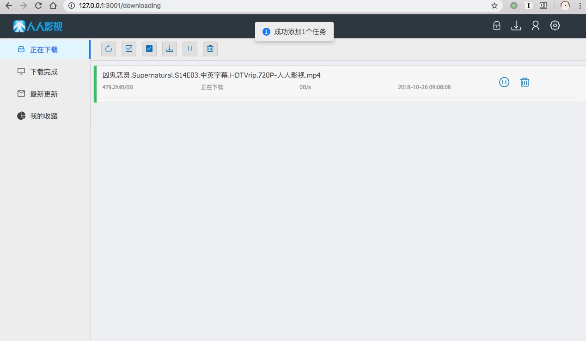

# docker-rrshare

美剧爱好者福音:
[人人影视WEB远程管理版](http://app.zimuzu.tv/)

支持群晖

## docker run

```bash
docker run --name rrshare \
  -d -p3001:3001 \
  -v ~/Downloads/rrshare:/opt/work/store:rw \
  krast0/rrshare:1.0
```

## web界面

默认锁屏密码：123456，可以在设置中修改。



## 异常处理

rrshare客户端做的好不太完善，最简单的删除重建

```bash
docker rm -f rrshare
```

## 愉快滴玩耍吧
